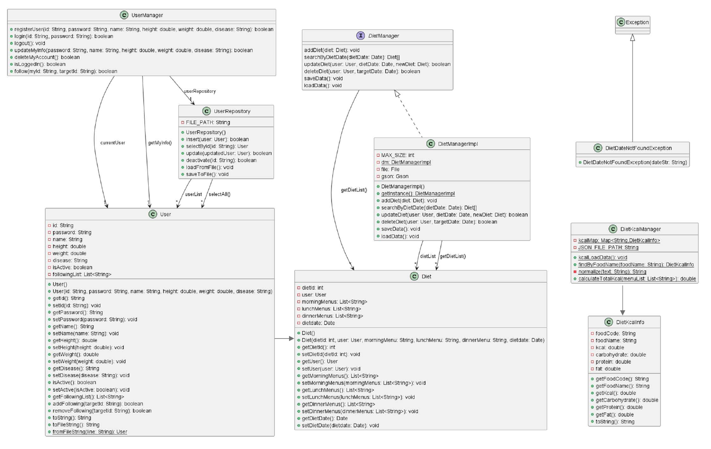

# 🥗 YumYum_Coach (냠냠코치)

> **개인 식단 관리 및 칼로리/영양성분 추적 콘솔 서비스**  
> 사용자의 개인 건강 정보를 기반으로 일일 식단을 기록하고, 칼로리 및 영양성분을 효율적으로 관리해 주는 Java 기반 프로그램입니다.

---

### 📌 주요 기능 (Features)

👤 1. 사용자 관리 (User Management)
- **회원가입 / 로그인 / 로그아웃**: 사용자 계정 관리 및 세션 유지
- **팔로우 기능**: 다른 사용자를 팔로우하여 식단 정보 공유 기반 제공

🍽️ 2. 식단 관리 (Diet Management)
- **오늘 식단 등록**: 실제 현재날짜의 아침, 점심, 저녁 식단 등록
- **전체 식단 목록 조회**: 등록된 모든 식단 데이터를 깔끔한 카드형 콘솔 UI로 출력
- **날짜별 식단 검색**: 지정한 날짜(`yyyy-MM-dd`)의 아침, 점심, 저녁 식단 기록 조회
- **날짜별 식단 수정**: 지정한 날짜(`yyyy-MM-dd`)의 아침, 점심, 저녁 식단 기록 수정, 없으면 등록 가능
- **날짜별 식단 삭제**: 지정한 날짜(`yyyy-MM-dd`)의 아침, 점심, 저녁 식단 기록 삭제

📊 3. 영양성분 및 칼로리 계산 (Nutrient & Calorie Tracker)
- **자동 영양성분 매핑**: 입력된 메뉴명을 기반으로 `DietKcalManager`를 통해 열량(kcal), 탄수화물, 단백질, 지방 정보 자동 계산
- **하루 총 칼로리 합계**: 끼니별 칼로리를 합산하여 일일 총 섭취 칼로리를 직관적으로 제공

---


### 📐 클래스 다이어그램 (Class Diagram)




---
### 🚀 실행 방법

- **프로젝트 클론 (Clone) 또는 다운로드**

   ```bash
   git clone https://github.com/jeonark123/YumYum_Coach.git
   ```
   
---
### 👨‍💻 개발 소감
- **전배준** : 이번 관통 프로젝트를 진행하며 지금까지 배운 자바(Java)의 개념들을 실전에 적용하고 복습할 수 있었으며 그 과정에서 제 스스로의 부족한 점을 명확히 인지하는 계기가 되었습니다.
특히 협업 과정에서 팀원의 중요성을 깊이 깨달았습니다. 팀원을 보며 제가 어떤 부분이 부족하고 어떤 식으로 협업 프로젝트를 진행해야 하는지 배울 수 있었습니다. 또한, 브랜치를 활용해 코드를 공유하고 병합하는 과정을 직접 경험하면서 GitHub를 활용한 협업에 대한 이해도가 조금 성장했다고 생각합니다. 이번 경험을 발판 삼아 다음 프로젝트에서는 더욱 성장한 모습으로 팀에 기여하고 싶습니다.
- **박예린** : 2주라는 짧은 시간 동안 배운 이론들을 실제 프로젝트에 사용해보면서 전체적인 흐름을 파악할 수 있었고, 이해도를 한 층 높일 수 있었습니다. 특히 2인 1조 팀 프로젝트로 진행하며 역할을 효율적으로 나누어 개발을 진행한 덕분에, 혼자 작업할 때보다 개발 속도를 높이고 완성도 있게 마무리할 수 있었습니다. 또한, AI 페어 프로그래밍을 활용해 구현한 기능적 요구사항을 점검하고 검증하는 과정을 거치면서 프로젝트의 진행 상황과 완성도를 다각도로 체크하는 데 큰 도움을 받았습니다. 앞으로 배울 내용들을 더 열심히 학습하여, 유용한 냠남코치로 발전시켜 나가고 싶습니다.
